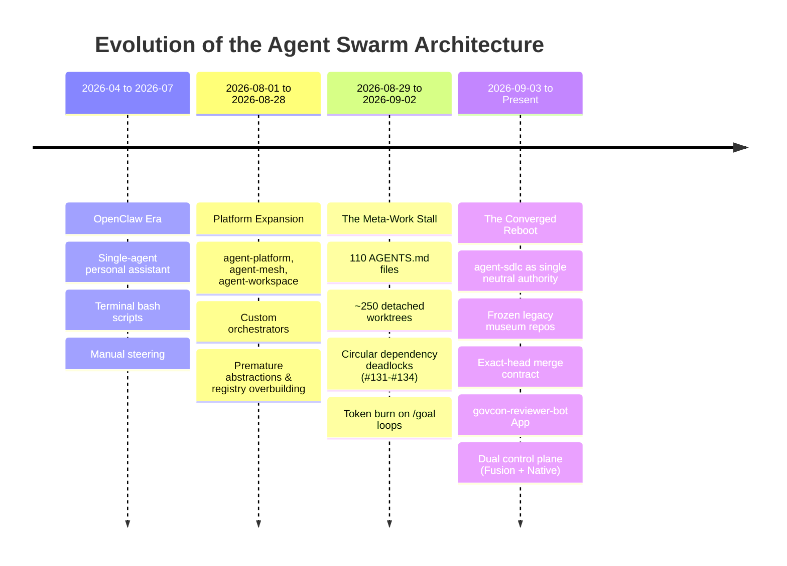

# The Arc of the Swarm & Comprehensive Root Cause Analysis (RCA)

**Authoritative Historical Record · redtrades AISDLC Platform**  
**Date:** 2026-09-04 · **Scope:** Global Estate (`agent-platform`, `agent-mesh`, `agent-workspace`, `govcon-factory`, `agent-knowledge-archive`, `agent-sdlc`, `agent-configs`)  
**Parent:** [agent-sdlc#117](https://github.com/redtrades/agent-sdlc/issues/117)

---

## 1. Executive Summary

Over four distinct generations of development, the agent swarm evolved from single-agent terminal experiments (`OpenClaw`) through massive multi-repo platform overbuilding (`agent-platform`, `agent-mesh`, `agent-workspace`), into an acute meta-work death spiral, and finally into a converged, evidence-gated AISDLC (`agent-sdlc`).

The primary breakdown was not model capability or token availability. It was an organizational failure mode: **the system rewarded improving the system rather than shipping product deliverables**. Every failure spawned more rules, more registries, and more worktrees, resulting in 110 `AGENTS.md` files, ~250 diverged worktrees, and circular blocking chains where simple 5-line fixes could not merge.

The estate has now converged on two crisp North Star objectives:
1. **AISDLC:** An autonomous, deterministic issue-to-merge loop running across heterogeneous agent harnesses (Jules, Codex, Grok, Claude, Hermes, OpenCode) with dual control planes (AISDLC real-time dashboard on port 4200 and Fusion orchestrator engine on port 4040).
2. **GovCon Deliverable:** An empirical, buyer-actionable federal capture packet (Decision 53 staged ladder in `govcon-corpus`), generating real revenue rather than recursive self-improvement.

---

## 2. The Four Eras of the Swarm

### Phase 1: The OpenClaw Era (Early 2026)
- **Architecture:** Monolithic bash and node wrapper around early LLM APIs. Focus on personal force-multiplication, terminal interaction, and prompt hacking.
- **Characteristics:** Unfenced filesystem access, state held in loose markdown files (`CLAUDE.md`, memory logs), zero test gating.
- **Failure Mode:** Context limits wiped memory; agents hallucinated file locations; changes clobbered user scripts; no rollback mechanism.

### Phase 2: The Multi-Repo Expansion (August 2026)
- **Architecture:** Split into multiple specialized repositories:
  - `agent-platform`: Attempted to build a provider-neutral agent OS, transaction kernel, and execution budget controller.
  - `agent-mesh`: Peer-to-peer agent communication and distributed locks.
  - `agent-workspace`: Coordination layer for Buzz, Claude, and Hermes.
  - `govcon-factory`: Domain product factory intended to run government contracting pipelines.
- **Characteristics:** Massive ambition. Custom AST parsers, custom RPC layers, custom git lease mechanisms, and multi-tier approval registries.
- **Failure Mode:** **Premature infrastructure before a working vertical slice.** The platform became so heavy that no agent could run it without encountering broken dependencies. Multiple controllers ran simultaneously and clobbered git checkouts.

### Phase 3: The Meta-Work Death Spiral (Late August 2026)
- **Characteristics:**
  - 110 `AGENTS.md` and 86 `CLAUDE.md` files scattered across home directory.
  - Over 250 stale git worktrees in various states of detached HEAD and dirty diffs.
  - Circular blocking chains: PRs for adapters (#131–#134) blocked on provider registry (#40), which blocked on issue #117, which blocked on work-item contracts (#137).
  - Identical tasks spawned 8–10 times (e.g., "format a GitHub reference" repeated in issues #5, #7, #13, #15, #31, #42, #45, #49, #55).
  - Millions of tokens burned on 24h+ marathon sessions that drifted into rewriting configuration rather than executing tasks.

### Phase 4: The Converged Reboot (September 2026)
- **Resolution:**
  - `agent-knowledge-archive` created to freeze historical documents as read-only evidence (EVIDENCE-MODE).
  - `agent-platform`, `agent-mesh`, `agent-workspace` frozen and archived.
  - `agent-sdlc` established as the single canonical implementation home for the AISDLC.
  - Deterministic 7-step engineering playbook instituted: Issue is Authority → Claim Scope → Isolated Worktree → `TASK.md` Contract → Surgical Implementation → Deterministic Verification (`npm test` / `pytest` exit 0) → Cross-family Review + `govcon-reviewer-bot` App APPROVE → Exact-Head Merge.
  - Dual control planes deployed: Port 4200 (real-time live dashboard) + Port 4040 (Fusion orchestration engine).

---

## 3. Root Cause Analysis (RC1 – RC7)

### RC1: Recursive Meta-Work With No Product Forcing Function
- **Symptom:** 95% of git commits and agent sessions modified configuration, rules, prompts, and orchestration harnesses rather than shipping revenue-generating deliverables.
- **Root Cause:** Improving the system has no natural stop condition. Product code requires external validation (customer acceptance, contract deliverables), whereas meta-code only requires self-consistent prose. Agents naturally path-find into self-referential tasks.
- **Remedy:** Decision 53 staged ladder. GovCon deliverable in `govcon-corpus` is the forced product milestone; AISDLC meta-work is strictly bounded to the 7-step delivery loop.

### RC2: Fragmentation of Authority (Competing Sources of Truth)
- **Symptom:** Each agent session read a different subset of 110 instruction files, reached a contradictory understanding of system policy, and opened conflicting PRs.
- **Root Cause:** Absence of a strict precedence hierarchy. When an agent read `agent-platform/docs/START-HERE.md`, it assumed it was canonical, even though `agent-knowledge-archive/00-start-here/START.md` had superseded it.
- **Remedy:** Hard rule: GitHub Issue is Authority. Local files, chat, and scratch are coordination only. Absolute estate cold-start path locked at `/Users/man/agent-knowledge-archive/00-start-here/START.md`.

### RC3: Uncontrolled Concurrency & Worktree Sprawl
- **Symptom:** ~250 git worktrees, detached HEAD commits, dirty uncommitted files clobbering each other across sessions.
- **Root Cause:** Agents spawned concurrent processes that modified the shared default checkout or left unmanaged worktrees behind without cleanup hooks or terminal reconciliation.
- **Remedy:** Fenced claims via `scripts/github-claim.mjs`. Worktrees isolated under `.worktrees/<issue-num>`. Cleanup required before lease release.

### RC4: Unverified Claims & Prose-Only "Proof"
- **Symptom:** Agents reported "Task completed! Everything looks good" while the actual code was uncommitted, unpushed, or failing tests (DFL-001, DFL-008).
- **Root Cause:** Relying on LLM self-assessment rather than deterministic shell exit codes.
- **Remedy:** Deterministic verification rule: A phase is verified ONLY when `npm run verify` or `pytest` exits 0. "Looks good" is rejected by CI gates.

### RC5: Self-Review and Review Invalidation (Changed-Head Merges)
- **Symptom:** An agent reviewed a PR, approved it, and then made a "small fix" commit before merging, invalidating the review (DFL-009, DFL-010).
- **Root Cause:** Same-account credentials and lack of cryptographic commit binding between review and merge.
- **Remedy:** Cross-family model review + dedicated `govcon-reviewer-bot` GitHub App approval. Exact-head merge rule: The commit SHA reviewed must byte-for-byte equal the commit SHA merged.

### RC6: Marathon Sessions & Context Drift
- **Symptom:** Sessions running 50+ turns losing their initial goal, forgetting constraints, and making sprawling "while-I-here" refactorings.
- **Root Cause:** Accumulation of tool outputs and compaction summaries diluting the original prompt.
- **Remedy:** WIP 1 rule: One issue → one worktree → one branch → one session. `TASK.md` re-read after any compaction. Discrete task done → stop immediately.

### RC7: Premature Abstraction & Unexecutable Registries
- **Symptom:** Months spent defining abstract provider adapters and contract interfaces that could not execute a single end-to-end task.
- **Remedy:** MVP basic routing: Smallest runnable vertical slice first. Standard library > installed packages > minimum new code.

---

## 4. Delivery Failure Ledger (DFL) Summary Table

| Category | DFL IDs | Core Prevention Control |
|---|---|---|
| **Git & Worktree Hygiene** | DFL-001, DFL-010, DFL-020 | All work pushed to branch + PR; isolated worktrees; local git author configuration. |
| **Thin Lifecycle Slicing** | DFL-002, DFL-012 | Build smallest runnable end-to-end slice before any component hardening. |
| **Fenced Authority & Boundaries** | DFL-003, DFL-004, DFL-011 | One issue, one role, typed return envelopes, single program queue on Issue #1. |
| **Artifact-First Checkpoints** | DFL-005, DFL-017, DFL-021 | Checkpoints require actual files and command exit codes; execution budget halts unbounded token spend. |
| **Independent Verification** | DFL-006, DFL-007, DFL-008, DFL-009 | Read-only reviewer; cross-family model; exact-head review binding; deterministic test verification. |
| **Infrastructure & Tokens** | DFL-013, DFL-014, DFL-015 | Scoped credentials, token isolation, restart integrity across runner failures. |
| **Board & Parity Synchronization** | DFL-019, DFL-022, DFL-024 | Terminal projection parity between GitHub Issues, Projects, and local state. Task deduplication before creation. |
| **Adapter Resilience** | DFL-023, DFL-025 | Fail-soft dependency loading; strict schema forcing for CLI adapters (Grok, OpenCode, Codex). |

---

## 5. Repository Inventory and Working State

| Repository / Path | Status | Role & Purpose | Working Rules for Agents |
|---|---|---|---|
| `/Users/man/agent-sdlc` | **LIVE (Primary)** | Canonical AISDLC composition, assurance contracts, and test fixtures. | GitHub issues are authority. Run `npm run verify` (189+ tests) before PR. Exact-head merge. |
| `/Users/man/agent-configs` | **LIVE** | Shared global rules (`rules/`), knowledge base, and harness configs (`~/.agents`). | Read-only unless explicitly asked to modify standing rules. Follow merge authority. |
| `/Users/man/agent-knowledge-archive` | **LIVE (Archive)** | Historical evidence archive, owner debriefs, and cold-start canon (`00-start-here/`). | Read-only evidence. Do NOT file issues or promote intent from subject packs. |
| `/Users/man/govcon-corpus` | **LIVE** | Empirical federal procurement corpus, factor alignment, and proposal grading. | Decision 53 staged ladder. All 266 tests passing. Preserved with zero code loss. |
| `/Users/man/Fusion` | **LIVE** | Native software factory & orchestration engine. Dashboard running on port 4040. | Bound to `redtrades/agent-sdlc`. AI engine active with local embedded PostgreSQL. |
| `/Users/man/agent-platform` | **FROZEN (Museum)** | Historical platform and transaction kernel experiments. | Evidence only. Do not execute or resurrect. |
| `/Users/man/agent-mesh` | **FROZEN (Museum)** | Historical P2P agent mesh and coordination experiments. | Evidence only. Do not execute. |
| `/Users/man/agent-workspace` | **FROZEN (Museum)** | Historical multi-harness coordination workspace. | Evidence only. Do not execute. |
| `/Users/man/govcon-factory` | **FROZEN (Museum)** | Historical capture-deliverables factory and SOPs. | Harvest-only for reusable scripts. Not product authority. |
| `/Users/man/agent-x` | **ADJACENT** | X/Twitter bot digests and article synthesizer. | Standalone. Do not fold into AISDLC critical path. |
| `/Users/man/agent-reports` | **REPORTS SINK** | Local non-canonical scratch, logs, and credential drops. | Not a git repository. Do not rely on for continuity. |

---

## 6. How Any Agent Picks Up Work from Scratch

Any agent launching in this estate (Antigravity, Claude, Codex, Grok, Hermes, OpenCode, Jules) must follow this exact sequence:

1. **Cold Start:** Read `/Users/man/agent-knowledge-archive/00-start-here/START.md` (North Star + ordered read list).
2. **Inspect Board:** View open tasks on `redtrades/agent-sdlc` via `gh issue list --repo redtrades/agent-sdlc` or Fusion board (`http://localhost:4040`).
3. **Claim Task:** Lock scope using `scripts/github-claim.mjs` or comment `/claim <harness>` on the GitHub issue.
4. **Create Worktree:** Run `git worktree add .worktrees/<issue-num> -b agent/<issue-num>`. Never edit the primary worktree.
5. **Write TASK.md:** Record GOAL, DONE-WHEN, SCOPE, and BOARD issue link before making changes.
6. **Execute & Verify:** Implement smallest surgical patch. Run repo verify command (`npm run verify` / `pytest`). Exit code must be 0.
7. **PR & Review:** Push branch, open PR linking issue (`Closes #<num>`), request cross-family model review, trigger `govcon-reviewer-bot` App APPROVE, and execute exact-head merge.
8. **Clean Up:** Prune worktree and branch. Update board status.
