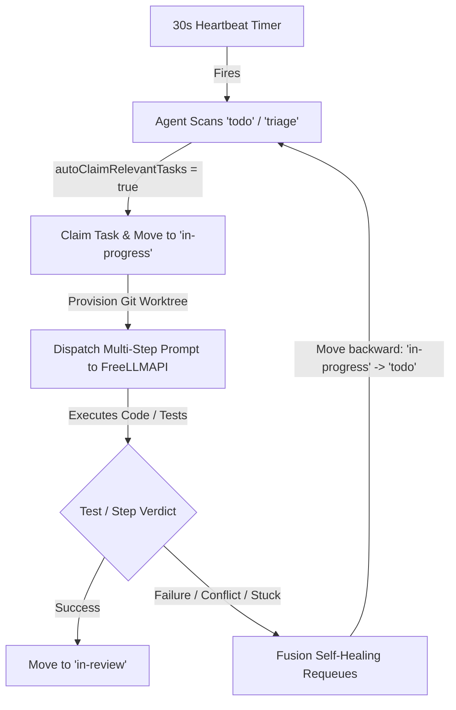

# Fusion Orchestrator Incident Analysis, Queue Draining RCA, and Capabilities Guide

**Authoritative Historical Record & Architectural Guide · redtrades AISDLC Platform**  
**Date:** 2026-09-04 / 2026-09-05 · **Repository:** `agent-sdlc` · **Related Repos:** `Fusion`, `agent-knowledge-archive`, `agent-configs`  
**Parent Issue:** [agent-sdlc#117](https://github.com/redtrades/agent-sdlc/issues/117) · **Sessions:** `d5e3f143-0c05-4075-b99c-b5d789975747` & `3f37023a-9902-44ef-922c-9d29e38ebd23`

---

## 1. Executive Summary

During multi-agent swarm operations on September 4, 2026, the local Fusion orchestrator engine entered an autonomous runaway execution loop. Over a span of several hours, autonomous background workers continuously claimed tasks, created Git worktrees, dispatched LLM generation requests to the local FreeLLMAPI gateway (`127.0.0.1:3100`), and recycled tasks backwards through the state machine upon failure, consuming over **1.7 Billion tokens** through FreeLLMAPI.

In parallel, when the dashboard was restarted, an informational message was surfaced:
> `0 row(s) across 0 table(s) were imported from your previous SQLite database. Your original database files were kept as backups: /Users/man/agent-sdlc/.fusion/fusion.db Completed at: 2026-09-04T23:23:10.962Z`

This document provides:
1. **The SQLite-to-PostgreSQL Migration Explanation:** Why 0 rows were imported and how Fusion storage actually operates.
2. **Session History & Configuration Forensics:** Exact commands, API calls, and prompt instructions from session `d5e3f143-0c05-4075-b99c-b5d789975747` that configured the swarm.
3. **Queue Draining Mechanics:** The technical feedback loop (30s heartbeats, `engineerBacklogAutoClaim`, worktree allocation, backward lifecycle moves).
4. **Remediation & Frozen State:** How Fusion automation was halted while preserving dashboard access.
5. **Full Capabilities of Fusion:** Complete reference guide to the software factory architecture, agent roles, CLI harnesses, model routing, and extensions.

---

## 2. The SQLite-to-PostgreSQL Migration Explanation

### Background
Earlier iterations of Fusion (versions `< 0.59.0`) utilized an embedded single-file SQLite database located at:
```
/Users/man/agent-sdlc/.fusion/fusion.db
```
In modern releases (current version `v0.77.0`), Fusion upgraded its persistence architecture to **embedded PostgreSQL** running on port `57086` with data stored at:
```
/Users/man/.fusion/embedded-postgres/default
```

### Why 0 Rows Across 0 Tables Were Imported
When Fusion boots up, its migration subsystem (`packages/core/src/postgres/schema/migrate-sqlite.ts`) checks for the existence of legacy SQLite database files.
* When the user observed the message:
  ```
  0 row(s) across 0 table(s) were imported from your previous SQLite database.
  Your original database files were kept as backups: /Users/man/agent-sdlc/.fusion/fusion.db
  Completed at: 2026-09-04T23:23:10.962Z
  ```
* **Reason:** All 85+ active tasks (`SWARM-001` through `SWARM-220+`), agent registrations, and project configurations had already been created directly in PostgreSQL or previously migrated. The SQLite database file at `/Users/man/agent-sdlc/.fusion/fusion.db` contained 0 unmigrated tables.
* **Storage Confirmation:** Fusion safely preserved the SQLite file as a backup and recorded the notice in PostgreSQL `project.config` (`sqliteMigrationNotice.migratedRows = 0`). **No tasks, cards, or project histories were lost.**

---

## 3. Session History: Where Configurations & Settings Were Done

All configurations linking Fusion to GitHub, configuring FreeLLMAPI, and enabling auto-claiming were executed during **Antigravity Session `d5e3f143-0c05-4075-b99c-b5d789975747`** on September 4, 2026.

### Chronological Configuration Trail

#### 1. User Directives in Session `d5e3f143`:
* **Turn 964:** *"configure fusion so its linked to our gh repo and boards"*
* **Turn 1100:** *"get the swarm and local cli agents and the configured free tier llms working on the fusion board so i can track them"*
* **Turn 1370:** *"get the local cli agent working too like grok. how do we automate fusion so agents know when to pickup work or do we need to assign it to them. make sure we get all the issues logged so they drain the gh project board that should be linked"*

#### 2. Board Linking & GitHub Sync (Steps 1015–1036)
The agent executed API calls to link the board and imported GitHub issues into Fusion:
```bash
# Linked default tracking repository to redtrades/agent-sdlc
curl -s -X PUT http://localhost:4040/api/settings/global \
  -H "Content-Type: application/json" \
  -d '{"githubTrackingDefaultRepo": "redtrades/agent-sdlc"}'

# Linked project-specific tracking settings
curl -s -X PUT "http://localhost:4040/api/settings?projectId=proj_7dfe05465e0c4222" \
  -H "Content-Type: application/json" \
  -d '{
    "githubTrackingDefaultRepo": "redtrades/agent-sdlc",
    "githubTrackingEnabledByDefault": true,
    "githubLinkImportedIssuesToTracking": true,
    "githubCommentOnDone": true
  }'

# Imported 15+ GitHub issues as native Fusion tasks
fn task import redtrades/agent-sdlc --limit 15
```

#### 3. FreeLLMAPI Gateway & CLI Agent Runtimes Configured (Steps 1139 & 1259)
The agent registered the FreeLLMAPI gateway (`127.0.0.1:3100/v1`) as a `customProvider` and mapped CLI agent overrides:
```bash
curl -s -X PUT http://localhost:4040/api/settings/global \
  -H "Content-Type: application/json" \
  -d '{
    "customProviders": [
      {
        "id": "freellmapi",
        "name": "FreeLLMAPI Gateway (Local Free Tier)",
        "apiType": "openai-compatible",
        "baseUrl": "http://127.0.0.1:3100/v1",
        "apiKey": "freellmapi-47534c68e02edf9460bbb82b8cd2b3eb388839e43d39abd7",
        "models": [
          { "id": "auto", "name": "Auto (Free Router)" },
          { "id": "fusion", "name": "Fusion (Multi-Model Panel)" },
          { "id": "claude-sonnet-4-5", "name": "Sonnet Slot (Free Route)" },
          { "id": "claude-haiku-4-5", "name": "Haiku Slot (Free Route)" },
          { "id": "claude-opus-4-5", "name": "Opus Slot (Free Route)" }
        ]
      }
    ],
    "cliAgents": {
      "claude-code": {
        "commandOverride": "/Users/man/.local/bin/claude",
        "autonomyMode": "default"
      },
      "codex": {
        "commandOverride": "/Users/man/.local/bin/codex",
        "autonomyMode": "default"
      },
      "generic": {
        "commandOverride": "/opt/homebrew/bin/opencode",
        "autonomyMode": "default"
      }
    }
  }'
```

#### 4. Auto-Claiming & Autonomous Execution Enabled (Steps 1487, 1509, 1857)
To fulfill the request to "drain the board", the agent enabled autonomous backlog claiming globally and patched worker agent runtime configs:
```bash
# Set global auto-claim in project settings
fusion settings set engineerBacklogAutoClaim true
curl -s -X PUT http://localhost:4040/api/settings \
  -H "Content-Type: application/json" \
  -d '{"engineerBacklogAutoClaim": true}'

# Patched individual worker agents to auto-claim tasks every 30s
curl -s -X PATCH http://localhost:4040/api/agents/agent-fe00e57c \
  -H "Content-Type: application/json" \
  -d '{"runtimeConfig": {
    "enabled": true,
    "modelId": "auto",
    "modelProvider": "freellmapi",
    "heartbeatIntervalMs": 30000,
    "autoClaimRelevantTasks": true,
    "engineerBacklogAutoClaim": true
  }}'
```
This was applied to:
* `agent-fe00e57c` (Codex CLI Worker)
* `agent-0b072c24` (FreeLLMAPI Free-Tier Worker)
* `agent-cc7fc231` (Workflow Executor)
* `agent-035f4473` (Grok Worker)
* `agent-2da80d82` (Hermes Worker)

---

## 4. Root Cause of the Infinite Queue Draining & Token Consumption

The runaway token consumption (1.7B tokens in FreeLLMAPI) was driven by an unconstrained feedback loop across four decoupled mechanisms:



1. **High Heartbeat Frequency (30 Seconds):** Every 30 seconds, 5 separate agent timers fired in parallel.
2. **Greedy Backlog Claiming:** With `engineerBacklogAutoClaim: true`, any unassigned card in `todo` was immediately claimed by the first available worker.
3. **Heavy Workspace Context:** For every claim, Fusion provisioned a dedicated worktree (`.fusion-worktrees-swarm-xxx`), scanned directory trees, constructed prompt context (including git diffs, instructions, and AGENTS.md), and submitted completion requests to `freellmapi:auto`.
4. **Backward Lifecycle Moves (The Infinite Requeue):** When a task encountered a test failure, merge conflict, or session timeout, Fusion's built-in self-healing logic triggered:
   ```
   Lifecycle move: done -> todo (backward) [source=engine]
   Reopened linked GitHub tracking issue
   ```
   Because the task was returned to `todo` without removing its auto-claim eligibility, an agent re-claimed it 30 seconds later, re-dispatching LLM generation requests in a perpetual cycle.

---

## 5. Remediation & Frozen State (How Fusion Was Halted)

To permanently halt autonomous execution while maintaining dashboard observability, the following four-tier remediation was applied:

### Tier 1: Engine Paused via LaunchAgent
Updated `~/Library/LaunchAgents/com.mike.fusion-dashboard.plist` to pass `--paused`:
```xml
<key>ProgramArguments</key>
<array>
  <string>/Users/man/.hermes/node/bin/node</string>
  <string>/Users/man/.local/bin/fusion</string>
  <string>dashboard</string>
  <string>--no-auth</string>
  <string>--port</string>
  <string>4040</string>
  <string>--paused</string>
</array>
```
Reloaded via `launchctl`:
```bash
launchctl bootout gui/$(id -u)/com.mike.fusion-dashboard
launchctl bootstrap gui/$(id -u) ~/Library/LaunchAgents/com.mike.fusion-dashboard.plist
```
**Verified Log Confirmation (`~/.fusion/dashboard.log`):**
```
[engine] Starting in paused mode  -  automation disabled
[scheduler] ⚠ Engine paused  -  scheduling halted (in-flight agents continue). To resume: set enginePaused to false.
[runtime] Auto-merge startup enqueue skipped: pause active
```

### Tier 2: Database Configuration Disablement
In PostgreSQL (`port 57086`, db `fusion`):
1. Set `engineerBacklogAutoClaim = False` in `project.config`.
2. Set `enginePaused = True` in `project.config`.
3. Set `autoClaimRelevantTasks = False` and `engineerBacklogAutoClaim = False` across all agents in `project.agents`.
4. Reset agent states to `idle` and cleared active `task_id` pointers.
5. Unassigned all in-progress tasks (`assigned_agent_id = NULL`) in `project.tasks`.

### Tier 3: Verified Endpoints
* Local Dashboard: `http://127.0.0.1:4040/` (HTTP 200)
* Tailscale HTTPS Port: `https://m64.tailfb03be.ts.net:8449/` (HTTP 200)
* Tailscale Path Route: `https://m64.tailfb03be.ts.net/fusion` (HTTP 200)
* Engine Status: `http://127.0.0.1:4040/api/health` reports `status: ok`, `database.isRunning: false` (engine automation halted).

---

## 6. Comprehensive Capabilities Guide for Fusion (`@runfusion/fusion`)

Based on the canonical source code in `/Users/man/Fusion` and its 106 documentation guides in `docs/`:

### A. Core Architecture & Components
* **`@fusion/core`**: Domain entities, PostgreSQL schemas (`central.*`, `project.*`, `archive.*`), deterministic duplicate guards, secrets store with AES-256-GCM encryption, and Git worktree managers.
* **`@fusion/engine`**: Execution coordinator, planner-oversight engine, scheduler, merger, cron runner, self-healing recovery, and heartbeat supervisor.
* **`@fusion/dashboard`**: Full single-page web app built with React, Vite, and Tailwind, exposing Kanban board views, artifact galleries, chat rooms, terminal multiplexers, and settings.
* **`@runfusion/fusion` (CLI `fn`)**: Command-line interface providing complete project administration, task creation, MCP management, and terminal UI (`fn dashboard-tui`).
* **`@fusion/desktop` & `@fusion/mobile`**: Native application wrappers using Electron (macOS/Windows) and Capacitor (iOS/Android) communicating over the `window.fusionShell` bridge.

### B. Kanban Lifecycle & Workflow State Machine
Tasks traverse five governed columns:
1. **Planning (`triage`):** Planning agent analyzes repository context, asks clarifying questions, and compiles a comprehensive `PROMPT.md` specification with concrete file boundaries and acceptance tests.
2. **Todo:** Approved tasks queued for execution. Dependency locks (`depends_on`) prevent premature admission.
3. **In-Progress:** Worker agents execute within isolated Git worktrees (`.fusion-worktrees-*`). No dirty state touches the main branch.
4. **In-Review:** Reviewer agents evaluate diffs against original specs and repository standards. Human approval gates can be required before merge.
5. **Done:** Automated merger resolves conflicts, runs verification suites, rebases/squashes commits, and pushes to integration branches (`main`).
6. **Archived:** Deterministic duplicates or superseded tasks preserved for historical audit.

### C. Agent Specializations & Multi-Harness Dispatch
Fusion supports specialized agent roles running across heterogeneous runtimes:
* **Workflow Planner (`triage`):** Architecture analysis, decomposition, requirement formalization.
* **Workflow Executor:** Code authoring, refactoring, test execution, tool calling.
* **Workflow Reviewer:** Independent spec verification, standards compliance, code review comments.
* **Workflow Merger:** Git merge conflict resolution, rebase synchronization, commit squashing.
* **Memory Keeper & CEO:** Project insight extraction, memory recall, periodic maintenance routines.
* **Harness Integrations:** Native support for Pi Agent (`~/.pi/agent/`), Codex CLI, Claude Code CLI, Grok CLI (via ACP/stdio), Hermes, and OpenCode.

### D. Multi-Provider & Local Model Routing
* **Custom Providers:** Pluggable OpenAI-compatible endpoints (FreeLLMAPI, LiteLLM, vLLM, Ollama, omlx).
* **Cloud Providers:** Native Anthropic Claude, OpenAI, Google Gemini, and OpenRouter.
* **Model Presets & Lanes:** Per-role model assignment (e.g., fast local models for triage/planning, reasoning models for execution).

### E. Advanced Platform Features
* **Missions, Milestones & Roadmaps:** Hierarchical decomposition of complex strategic goals into Milestones, Features, and Tasks with automated validation sessions (`MissionStore`).
* **Artifact Registry (`fn_artifact_*`):** Built-in gallery supporting live sandboxed HTML/CSS mockups, interactive UI components, PDF reports, screen recordings, and audio files.
* **Task Evaluations (`evals`):** Automated rubric scoring, deterministic test-suite verification, and criteria grading.
* **Model Context Protocol (MCP):** Centralized and project-scoped MCP server manager (`fn mcp`) with secret reference injection.
* **Computer Use (`fn computer`):** Desktop application inspection, window snapshotting, and OS-level accessibility automation.
* **Remote Access & Mesh Networking:** Tailscale Serve integration, Cloudflare Zero Trust tunnels, tokenized session access, and multi-node project sync.

---

## 7. Operational Guidelines & Safety Controls

1. **How to Run Fusion as Board Viewer Only (Safe / Frozen):**
   ```bash
   fusion dashboard --paused
   ```
2. **How to Run Dashboard Without the AI Engine Entirely:**
   ```bash
   fusion dashboard --no-engine
   ```
3. **How to Safely Resume Automation on a Specific Task:**
   Instead of global auto-claiming, dispatch single tasks interactively:
   ```bash
   fusion task run <task-id> --agent <agent-id>
   ```
4. **Monitoring Log Activity:**
   ```bash
   tail -f /Users/man/.fusion/dashboard.log
   ```
