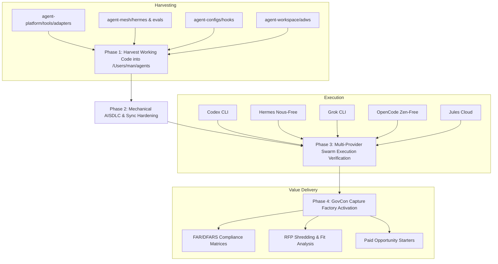

# First-Principles Estate Architecture & Swarm Unification Plan

## Executive Summary: First-Principles Grounding

Over the past week, multiple sessions in `agent-sdlc`, `agent-configs`, and scratchpads (`/private/tmp/...`) attempted to bootstrap an MVP. While significant progress was made (draining backlogs, stabilizing Fusion to 80 completed tasks, 264 passing tests in `agent-sdlc`, scaffolding `/Users/man/agents`), previous attempts repeatedly fell into **three recurring traps**:

1. **The "Freeze Everything" Dogma**: Declaring active repositories (`agent-platform`, `agent-mesh`, `agent-workspace`, `govcon-factory`) "museum evidence" stranded battle-tested code (e.g. `agent-platform/tools/adapters/` with tested adapters for Claude, Codex, Hermes, and OpenCode; `agent-mesh`'s Apple Silicon OMLX/Qwen configurations; `agent-workspace`'s SSSF coordination). Calling them frozen led agents to reinvent lower-quality bash wrappers in `agent-sdlc`.
2. **The "Rules About Rules" Meta-Work Spiral**: Generating dozens of contradictory governance documents (e.g., 20 rule files vs. 5 rules in YAML pseudocode without an execution engine) while failing to deploy the actual CLI agents Mike requested.
3. **The False "Symphony vs. Fusion" Dichotomy**: The Claude Code session in `docs/phase-1-planning/05-UNIFIED-EXECUTION-PLAN-2026-09-05.md` arbitrarily decreed "Symphony + Codex MVP (not Fusion)", ignoring that Fusion is already running on port 4040, backed by embedded Postgres, and explicitly mandated in ADR 0005 as the dual visual control plane.

### Mike's True North Star & End State
From first principles and Mike's explicit founding directives (Apr 2026 Debrief, Decisions 1–58, ADR 0005):
- **Agnostic, Composable Swarm**: A plug-and-play architecture where any brain (model) and body (CLI harness: Codex, Claude, Hermes, Grok, OpenCode, Jules) can execute tasks autonomously without single-vendor dependency.
- **Cost-Tiered Model Matrix**: Seamless tiering from local zero-cost inference (OMLX/Qwen on Apple Silicon) $\to$ free-tier APIs (FreeLLMAPI port 3100, OpenRouter free, Nous free, Zen free) $\to$ cheap cloud (Gemini Flash free 1M context) $\to$ high-judgment paid models (Claude Opus 4.8 / o1) reserved strictly for audits and architecture.
- **Resilient Autonomous Execution**: Mid-task model rate-limits or worker deaths must not stall the swarm. Bounded execution uses isolated Git worktrees, atomic task claims, deterministic shell verification (`npm test` / `pytest` exit 0), and cross-family reviewer verification signed by `govcon-reviewer-bot`.
- **The Economic Driver (GovCon Engine)**: The swarm is not an academic toy. Its purpose is to automate federal proposal operations, extracting FAR/DFARS compliance matrices, RFP requirements, and opportunity packets from `govcon-corpus` and `cmp1` to generate $8,000–$10,000/month in high-margin business value.

---

## First-Principles Reconciliation of Phase 1 Planning Debrief

The recent Claude Code session in `~/agent-sdlc/docs/phase-1-planning/` identified 7 contradictions and 5 implementation gaps. Here is the first-principles resolution for each:

| Dimension | Phase-1 Debrief Contradiction | First-Principles Resolution |
|---|---|---|
| **1. Rule Quantity** | 20 rule files in `agent-configs` vs. 5 rules in YAML | **Executable Contract over Prose**: Rules are constraints, not essays. Embed the 5 critical gates mechanically in `agents/src/aisdlc.ts` and hooks (WIP=1, duplicate breaker, fail-closed credentials, reviewer separation, exact-head Git check). The remaining 15 are retained as reference guidelines in `docs/`. |
| **2. Free-Tier Routing** | 5-hop FreeLLMAPI cascade vs. Gemini Flash direct | **Cost-Tiered Matrix (Tier 0 $\to$ Tier 3)**: Keep FreeLLMAPI (port 3100) and OMLX local as Tier 0 (zero-cost high-volume). Use Gemini Flash (1M context) as Tier 1. Use Codex/Claude Sonnet/Grok as Tier 2. Reserve Claude Opus as Tier 3 for high-judgment gates. |
| **3. Tier Taxonomy** | Quick/MVP/Standard/Audit vs. simple/med/complex | **Operational 4-Tier Standard**: Adopt `Quick`, `MVP`, `Standard`, `Audit` (matches `CLAUDE.md` and user tooling). Mapped deterministically by keyword scoring. |
| **4. Control Plane** | Symphony only vs. Fusion only | **Ratify ADR 0005 Dual Plane**: GitHub Issues = sole backlog authority; Fusion (port 4040) = visual orchestrator and dependency graph; Port 4200 = real-time telemetry. Fix the two-way sync seam to eliminate task rebound loops. |
| **5. Review Architecture** | Single serial reviewer vs. parallel multi-agent | **Risk-Adaptive Two-Tier Review**: Class A (internal code/docs) = 100% deterministic CI + 1 independent cross-family LLM review. Class B (security, schema, GovCon compliance) = CI + multi-agent check + human sign-off. |
| **6. WIP Atomicity** | Non-atomic pseudocode `active >= 3` | **Mechanical File-Lock / DB Serialization**: Claim scripts use atomic lockfiles (`.claim.lock`) or Fusion database transactions with compare-and-swap, eliminating check-then-act races. |
| **7. Code Asset Reuse** | Keep repos frozen as "museums" | **Harvest into `/Users/man/agents`**: Extract tested adapters (`agent-platform`), local evals (`agent-mesh`), safety hooks (`agent-configs`), and SSSF modules (`agent-workspace`) into the clean `/Users/man/agents` scaffold. |

---

## User Review Required

> [!IMPORTANT]
> **Consolidation Target (`/Users/man/agents`)**:
> Jules has already scaffolded `/Users/man/agents` (`ee29bfb`) with 11 passing tests. We propose harvesting the working adapters from `agent-platform` (`implementer/{claude,codex,hermes,opencode}.py`, `reviewer/codex.py`), the OMLX/Qwen configs from `agent-mesh`, and the safety hooks from `agent-configs` into this clean repository. This eliminates estate fragmentation without losing any working code.

> [!NOTE]
> **Dual Control Plane Architecture**:
> We will NOT discard Fusion (port 4040) or FreeLLMAPI (port 3100). Fusion provides the visual dependency engine and local orchestration, while GitHub Issues provides the authoritative audit trail. The real-time dashboard on port 4200 monitors both.

---

## Open Questions for Mike

1. **Jules Authentication**: Do you prefer Jules to handle cloud GitHub PRs via the `jules` label, or should we route all autonomous tasks through local CLI workers (Codex, Hermes, Grok, OpenCode) first?
2. **Local Inference Priority**: Is OMLX running Qwen 2.5 / 3.8 on your Apple Silicon available for local offline tasks, or should Tier 0 prioritize FreeLLMAPI (OpenRouter/Nous/Zen free models) via `127.0.0.1:3100`?
3. **Estate Repository Disposition**: Once `/Users/man/agents` has harvested all tested adapters and evals, do you approve archiving `agent-platform`, `agent-mesh`, and `agent-workspace` to GitHub read-only archives to prevent agents from getting confused by legacy directories?

---

## Phased Plan of Attack



### Phase 1: Estate Harvesting & Repository Unification (`/Users/man/agents`)
**Goal**: Unify tested, valuable code from the 4 fragmented repos into `/Users/man/agents` with 100% test coverage.
- [NEW] Migrate `agent-platform/tools/adapters/implementer/` (`claude.py`, `codex.py`, `hermes.py`, `opencode.py`) and `reviewer/` (`codex.py`) into `agents/src/adapters/`.
- [NEW] Migrate `agent-mesh/hermes/` and `agent-mesh/evals/` (OMLX Apple Silicon configs, Qwen benchmark scripts) into `agents/src/evals/` and `agents/runtimes/omlx/`.
- [NEW] Migrate `agent-workspace/adws/` (SSSF coordination data models and gates) into `agents/src/coordination/`.
- [NEW] Migrate critical safety hooks from `agent-configs/hooks/` (damage control, env protection, task tracking) into `agents/src/hooks/`.
- Run comprehensive test suite in `/Users/man/agents` (`npm test` and `pytest`).

### Phase 2: Mechanical AISDLC & Sync Hardening
**Goal**: Stop ghost loops, ensure atomic WIP, and make governance enforceable in code.
- Implement atomic WIP reservation (`agents/src/aisdlc.ts`): mechanical compare-and-swap locking for issue claims (`.claim.lock`).
- Implement pre-flight credential format validation (presence + expected token prefixes, fail-fast before execution).
- Implement two-way GitHub $\leftrightarrow$ Fusion synchronization seam: when an issue or PR is closed on GitHub, atomically mark the Fusion task `done` in embedded Postgres to prevent re-opening loops.
- Configure keyword-based tier detection (`Quick`, `MVP`, `Standard`, `Audit`) as an automated GitHub Action / local pre-claim hook.

### Phase 3: Multi-Provider Worker Swarm Verification
**Goal**: Verify all local CLI agents and cloud workers can pick up, execute, and deliver board tasks.
- Verify FreeLLMAPI (`127.0.0.1:3100`) routing: test Nous free tier, OpenRouter free models, and Zen models.
- Verify local CLI worker executions in isolated worktrees:
  - `codex` worker for deterministic code changes.
  - `hermes` worker for mechanical lint and refactoring tasks.
  - `grok` worker for fast text/data extraction.
  - `opencode` worker for bounded modules.
  - `claude` (Claude Code) for high-judgment architectural and Class B review tasks.
- Execute an end-to-end canary issue through the full 7-step SDLC: Issue $\to$ Claim $\to$ Worktree $\to$ TASK.md $\to$ Verify $\to$ `govcon-reviewer-bot` App Review $\to$ Exact-Head Squash Merge.

### Phase 4: GovCon Capture Factory Activation
**Goal**: Turn the operational swarm onto the GovCon revenue pipeline.
- Connect the swarm to `govcon-corpus` and `cmp1` data assets.
- Deploy the FAR/DFARS automated compliance extraction pipeline (Section C/L/M shredding).
- Produce verified, evidence-grounded proposal opportunity starters and diagnostic fit deliverables.

---

## Verification Plan

### Automated Tests
1. **Agents Repository Test Suite**:
   ```bash
   cd /Users/man/agents && npm test
   pytest /Users/man/agents/tests
   ```
2. **SDLC Integration & Verification**:
   ```bash
   cd /Users/man/agent-sdlc && npm run verify
   ```
3. **Control Plane & Health Endpoints**:
   ```bash
   curl -s http://localhost:4200/api/status | jq .
   curl -s http://localhost:4040/api/health
   curl -s http://127.0.0.1:3100/health
   ```
4. **WIP Concurrency & Lock Tests**:
   - Run 5 concurrent simulated claims against the claim script; assert exactly 1 succeeds and 4 receive structured backpressure without corruption.

### Manual Verification
1. Inspect Fusion UI at `http://localhost:4040` to confirm task synchronization matches GitHub issue reality without duplicate generation.
2. Confirm the multi-provider roster (Codex, Hermes, Grok, OpenCode, Claude) successfully completes a synthetic test task end-to-end.
