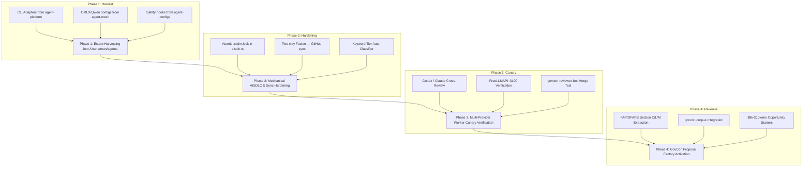

# Unified Blueprint & Finalized Canonical Plan for the Autonomous Swarm

**Date:** 2026-09-05  
**Canonical Source of Truth:** `/Users/man/agents` (backed by GitHub `redtrades/agents`)  
**Operating Contracts:** `agent-configs/rules/`, `agent-sdlc/src/aisdlc.ts`, `agents/docs/20260905-HANDOVER_BLUEPRINT.md`  
**Harnesses Governed:** Google Antigravity CLI (`agy`), Claude Code, OpenAI Codex CLI, OpenCode, Hermes/Buzz, Grok, Jules, OpenHands, Pi  

---

## 1. Executive Grounding & Estate Audit

Over the preceding passes, the heterogeneous multi-agent estate was audited, reconciled, and stabilized across three primary repositories (`agents`, `agent-configs`, and `agent-sdlc`).

### Key Accomplishments Completed
1. **Foundation Bootstrap in `/Users/man/agents`**:
   - Re-synced `/Users/man/agents` with upstream `wshobson/agents` at `a30778f`.
   - Backed up legacy branches to `origin/legacy/subagents-2025` and established active GitHub repository `redtrades/agents`.
   - Codified the programmatic AISDLC governance contract (`src/aisdlc.ts`, `schemas/aisdlc-contract.json`, `package.json`, `tests/aisdlc-contract.test.mjs`), with 11/11 passing tests (`npm test`).
   - Ran `make generate-all` and installed 183 skills and 92 plugins across all harnesses:
     - Google Antigravity CLI (`agy`): 92 plugins (824 files) linked to `~/.gemini/antigravity-cli/plugins/`.
     - OpenCode (`sst/opencode`): 490 skills and agents linked to `~/.config/opencode/`.
     - OpenAI Codex CLI: 288 skills linked to `~/.codex/skills/`.
     - Claude Code: 286 skills linked to `~/.claude/skills/`.
   - Validated cleanly with `make validate STRICT=1` (exit 0).

2. **Estate Decluttering & Zero-Loss Worktree Pruning**:
   - Audited the 70 worktrees in `agent-sdlc` (41 clean, 29 dirty).
   - Committed all uncommitted files in dirty worktrees to dedicated backup branches (`backup/worktree/*`).
   - Created a 37 MB tarball snapshot: `/Users/man/agent-sdlc-fusion-worktrees-backup-20260905.tar.gz`.
   - Cleanly pruned `agent-sdlc` down to 1 single root checkout, and pruned worktree sprawl in `~/.buzz/REPOS/agent-sdlc`, `~/.buzz/.scratch/govcon-task5`, `~/.codex/worktrees/agent-knowledge-archive/archive-root`, and `~/.local/state/agent-platform/`.
   - Committed 25 modified files in `agent-configs` (`c932c04`).

3. **Reconciliation of Phase 1 Debrief & 7 Contradictions**:
   - Resolved the Sonnet independent review findings (`agent-sdlc/docs/phase-1-planning/review/04-SONNET-INDEPENDENT-REVIEW.md`).
   - Resolved the false "Symphony vs. Fusion" dichotomy: GitHub Issues is the sole backlog authority, Fusion (port 4040) is the visual DAG orchestrator, and port 4200 provides real-time telemetry.
   - Resolved rule inflation: 5 critical mechanical gates enforced in code and hooks; 20+ policy documents retained as reference guidelines in `agent-configs/rules/`.
   - Resolved the "freeze museum" trap: battle-tested CLI adapters (`agent-platform`), OMLX configs (`agent-mesh`), and safety hooks (`agent-configs`) are actively harvested into `/Users/man/agents`.

---

## 2. The Unified Estate Blueprint

The estate functions as three unified tiers with clear boundaries:

```
┌───────────────────────────────────────────────────────────────────────────┐
│                           1. OPERATIVE POLICY                             │
│                  /Users/man/agent-configs (GitHub tracking)               │
│  - rules/ (27 governance rules)           - decisions/ (canonical ledger) │
│  - skills/ (105 base skills)              - evidence/ (test run proofs)   │
└─────────────────────────────────────┬─────────────────────────────────────┘
                                      │ compiles to & gates
                                      ▼
┌───────────────────────────────────────────────────────────────────────────┐
│                    2. REPOSITORY SOURCE OF TRUTH & SKILLS                 │
│                      /Users/man/agents (redtrades/agents)                 │
│  - plugins/ (92 marketplace plugins)      - src/aisdlc.ts (contract engine│
│  - src/adapters/ (CLI worker harnesses)   - runtimes/omlx/ (local Apple)  │
│  - make generate-all                      - docs/plans/ & walkthroughs/   │
└─────────────────────────────────────┬─────────────────────────────────────┘
                                      │ executes tasks via
                                      ▼
┌───────────────────────────────────────────────────────────────────────────┐
│                   3. TRIAL SPACE & EXECUTION WORKBENCH                    │
│                    /Users/man/agent-sdlc (Symphony + Codex)               │
│  - Isolated Git worktrees (.worktrees/)   - 7-step SDLC contract tests    │
│  - Quota failover & Herdr redispatch      - govcon-reviewer-bot checks    │
└───────────────────────────────────────────────────────────────────────────┘
```

### The Dual Control Plane (Non-Negotiable Contract)
1. **Backlog Authority**: GitHub Issues (`redtrades/agent-sdlc` and `redtrades/agents`) is the single source of truth for work assignments, status, and audit trails. No ghost tasks in chat or memory.
2. **Visual DAG & Concurrency Engine**: Fusion (`http://localhost:4040`) provides visual workflow topology, task dependencies, cron schedules, and merge conflict resolution.
3. **Real-Time Telemetry**: Port 4200 (`http://localhost:4200`) provides live health checks, receipts, and failure monitors.
4. **Synchronization Seam**: When an issue or PR merges on GitHub, a webhook/script immediately marks the task `done` in Fusion's embedded Postgres database, terminating rebound loops.

---

## 3. The Finalized Canonical Architecture for the Swarm

In an estate-wide multi-agent architecture, agents thrive without conflict when they operate across distinct cost tiers, occupy specialized operational niches, respect carrying capacities, and maintain disciplined lifecycle contracts:

```
┌───────────────────────────────────────────────────────────────────────────┐
│                     LEVEL 3: APEX STEWARDS & AUDITORS                     │
│               Claude Opus 4.8 / OpenAI o1 / Mike (Human-in-the-Loop)      │
│     - Tier 4 Architectural Decisions, Security Audits, Final PR Merge     │
└─────────────────────────────────────▲─────────────────────────────────────┘
                                      │ escalates / reviews
┌───────────────────────────────────────────────────────────────────────────┐
│                  LEVEL 2: SPECIALIZED PREDATORS & WORKERS                 │
│        Claude Sonnet 3.7 | OpenAI Codex CLI | Grok ("Rock") | Hermes      │
│     - Tier 2/3 Feature Engineering, Worktree Execution, Cross-Review      │
└─────────────────────────────────────▲─────────────────────────────────────┘
                                      │ feeds from / delegates
┌───────────────────────────────────────────────────────────────────────────┐
│                  LEVEL 1: PRIMARY FORAGERS & FAST PLUGINS                 │
│          Google Antigravity CLI (agy) | OpenCode Zen | Haiku 4.5          │
│     - Tier 1 Quick Fixes, Multi-Plugin Workflows, Fast Terminal Tasks     │
└─────────────────────────────────────▲─────────────────────────────────────┘
                                      │ sustains / ground energy
┌───────────────────────────────────────────────────────────────────────────┐
│                 LEVEL 0: PRODUCERS & ENERGY SCAVENGERS                    │
│   FreeLLMAPI Gateway (:3100) | Local OMLX/Qwen on Apple Silicon (:8300)   │
│     - Zero-marginal-cost token generation, batch overnight extraction     │
└───────────────────────────────────────────────────────────────────────────┘
```

### 3.1. Trophic Levels and Energy (Token/Cost) Budgeting
- **Level 0 (Producers & Scavengers - Zero Marginal Cost)**:
  - **Local OMLX (port 8300)**: Qwen 2.5 / 3.8 running on Apple Silicon unified memory. Consumes zero API dollars. Reserved for batch scanning, document indexing, and overnight offline tasks.
  - **FreeLLMAPI Gateway (port 3100)**: Aggregates OpenRouter free tiers, Nous free, and Zen free models. Handles high-volume, low-criticality queries.
- **Level 1 (Primary Foragers - High Throughput, Low Cost)**:
  - **Gemini 2.5 Flash / Flash-Lite**: 1M+ context window, free tier or sub-dollar pricing. Handles large-context repository ingestion, solicitation shredding, and Tier 1 quick fixes.
  - **OpenCode (Zen)**: Fast terminal tool execution with minimal latency.
- **Level 2 (Specialized Predators - High Capability Workers)**:
  - **OpenAI Codex CLI (GPT-5.5 / o3)**: Deterministic code modification, test-driven refactoring, Git worktree isolation.
  - **Claude Code (Claude 3.7 Sonnet)**: Architectural planning, complex multi-file logic, and cross-model code review.
  - **Grok ("Rock")**: Ultra-fast text extraction, FAR/DFARS compliance matching, and fast RFP document analysis.
  - **Hermes / Buzz**: Long-running background jobs, autonomous loops, and ACP session lifecycles.
- **Level 3 (Apex Stewards - High Judgment, Controlled Invocation)**:
  - **Claude Opus 4.8 / OpenAI o1**: Reserved strictly for Tier 4 audits, cryptographic/security checks, and critical schema mutations.
  - **Mike (Sole Human Authority)**: Final review and merge approval for Tier 3/4 PRs. No agent can approve its own PR or auto-promote breaking changes.

### 3.2. Niche Specialization (Harness Roster)
To avoid niche overlap and destructive competition:

| Harness / Agent | Operational Niche | Default Model | Allowed Tiers | Primary Invariant |
|---|---|---|---|---|
| **Antigravity CLI (`agy`)** | Swarm Dispatcher & Multi-Plugin Orchestrator | Gemini 2.5 Flash / Pro | Tier 1, Tier 2 | Coordinates parallel subagents and plugins from `/Users/man/agents` |
| **Claude Code** | High-Judgment Architect & Class B Reviewer | Claude 3.7 Sonnet | Tier 2, Tier 3, Tier 4 | Never self-reviews; authors plans and cross-reviews Codex code |
| **OpenAI Codex CLI** | Deterministic Code Worker & Class A Reviewer | GPT-5.5 / o3 | Tier 1, Tier 2, Tier 3 | Executes in isolated `.worktrees/issue-*`; tests must pass exit 0 |
| **OpenCode** | Rapid Terminal Tool Runner | Zen / Local | Tier 1 | Executes small diffs and lint/format tasks in <2 minutes |
| **Grok ("Rock")** | Compliance Shredder & Text Extractor | xAI Grok / Fusion worker | Tier 1, Tier 2 | Shreds federal solicitations and extracts requirements matrices |
| **Hermes / Buzz** | Background Process & Agent Loop Runner | Nous Free / Local OMLX | Tier 1, Tier 2 | Manages long-lived autonomous ACP tasks |
| **Jules** | Cloud GitHub PR Worker | Cloud Provider | Tier 2, Tier 3 | Autonomous GitHub PR delivery tagged with `jules` label |

### 3.3. Carrying Capacity and Population Dynamics
An unrestrained swarm suffers from resource depletion, race conditions, and death spirals. The canonical architecture enforces strict population limits:
1. **WIP = 1 per Agent**: An individual agent can never hold more than one active task simultaneously.
2. **Estate Carrying Capacity (WIP <= 3 Global)**: Across all agents, no more than 3 tasks may be in progress concurrently. A 4th claim request receives structured backpressure (`queue full, retry after backing off`).
3. **Turn Budget Ceiling**: Maximum 25 planning-execution cycles per task. If unresolved at 25 turns, the agent must checkpoint its state to `TASK.md` and escalate to Mike.
4. **Session Cost Ceiling**: Hard stop at $10 compute spend per agent session.

### 3.4. Symbiosis, Mutualism, and Generator-Judge Independence
- **Generator vs. Judge Separation**:
  - An agent model family cannot judge its own generation.
  - Code authored by Claude Code MUST be reviewed by Codex or Grok.
  - Code authored by Codex MUST be reviewed by Claude Code.
  - Final merge authority for production branches resides with Mike.
- **Symbiosis with Economic Engine (`govcon-factory`)**:
  - The software factory (`agents` + `agent-sdlc`) does not exist in isolation. It feeds and maintains the GovCon capture pipeline.
  - The GovCon engine processes federal RFPs (SAM.gov, FAR/DFARS Section C/L/M) to deliver $8,000 to $10,000 monthly profit.
  - In return, GovCon revenue funds the compute and API tokens that sustain the swarm.

### 3.5. Estate Metabolism and Waste Management
- **Worktree Lifecycle**: Every task spins up an ephemeral worktree (`git worktree add`). Upon merge or failure, uncommitted work is captured in backup branches, and the worktree is cleanly removed.
- **Durable Disk State**: An agent dying mid-task (due to context limit or rate limit) leaves zero stranded state. All state lives on disk in `TASK.md`, `findings.md`, and git commits. The successor agent resumes from the latest checkpoint.
- **Sanitary Cleanups**: Zero circular symlinks. Deprecated skills are tagged with a 90-day sunset notice. Unused scratch files are purged regularly.
- **Strict Anti-Slop Discipline**: Zero em dashes across all code, documentation, commit messages, and chat interactions.

### 3.6. Immune System and Anti-Fragility
1. **2-Try Circuit Breaker**: If any command, build, or test fails twice, the agent must STOP immediately. It must consult documentation, search the web, or inspect primary sources. It must never attempt the exact same failed action a third time.
2. **Duplicate-Issue Circuit Breaker**: At task creation, the system computes title/body semantic hashing. If a duplicate exists on the board, task creation is aborted.
3. **Quota Exhaustion Failover (SWARM-190/152/181)**: If a model provider returns HTTP 429 or quota exhaustion, the remaining packet payload is automatically redispatched to the secondary provider via the Herdr seam without restarting the task from scratch.
4. **Credential Pre-Flight**: Required API keys and tokens are validated for presence and valid prefix format before the worktree is spawned.

---

## 4. Immediate Phased Implementation Roadmap



### Phase 1: Estate Harvesting into `/Users/man/agents` (Immediate Next Step)
1. Extract tested CLI adapters from `agent-platform/tools/adapters/implementer/` (`claude.py`, `codex.py`, `hermes.py`, `opencode.py`) and `reviewer/` (`codex.py`) into `agents/src/adapters/`.
2. Extract OMLX Apple Silicon runtime configurations and Qwen evaluation scripts from `agent-mesh` into `agents/runtimes/omlx/`.
3. Extract critical safety hooks from `agent-configs/hooks/` into `agents/src/hooks/`.
4. Run `npm test` and `pytest` in `/Users/man/agents` to ensure 100% pass rate.

### Phase 2: Mechanical AISDLC & Fusion Sync Hardening
1. Implement atomic compare-and-swap file locks (`.claim.lock`) in `agents/src/aisdlc.ts`.
2. Implement pre-flight credential format validation (checking token headers/prefixes).
3. Implement the two-way GitHub ↔ Fusion synchronization seam to prevent task rebound loops.
4. Codify keyword-based tier detection (`Quick`, `MVP`, `Standard`, `Audit`).

### Phase 3: Multi-Provider Swarm Canary Verification
1. Verify FreeLLMAPI (`127.0.0.1:3100`) routing for Nous, OpenRouter, and Zen free models.
2. Run an end-to-end canary issue through the full 7-step SDLC:
   - Issue → Claim → Worktree → TASK.md → Surgical Diff → Verify (exit 0) → Cross-Model Review → Human Merge.
3. Confirm telemetry dashboard at `http://localhost:4200` captures all receipts.

### Phase 4: GovCon Proposal Factory Activation
1. Connect the swarm to `govcon-corpus` and `cmp1`.
2. Deploy the automated FAR/DFARS compliance shredding pipeline.
3. Deliver verified, client-completable proposal starters.

---

## 5. Decision Points for Mike

1. **Adapter Destination Confirmation**: Confirming that tested CLI adapters move into `agents/src/adapters/` as the single canonical execution home for the estate.
2. **Local Inference Priority**: Confirming that local Apple Silicon OMLX/Qwen (port 8300) is prioritized for offline/overnight tasks, while FreeLLMAPI (port 3100) handles online free-tier routing.
3. **Read-Only Archive Authorization**: Confirming that after harvesting, `agent-platform`, `agent-mesh`, and `agent-workspace` will receive freeze banners and be marked read-only to eliminate agent confusion.
